
<h1>Compte-Rendu</h1>

L'objectif de ces travaux pratique est de créer un broker Kafka pour envoyé des messages vers un topic
par un producer et le reçoi ce message par un consumer.
<h3>Dans ce TP on utilise spring cloud streams function</h3>
<li><b>Kafka broker et zookeeper</b></li>
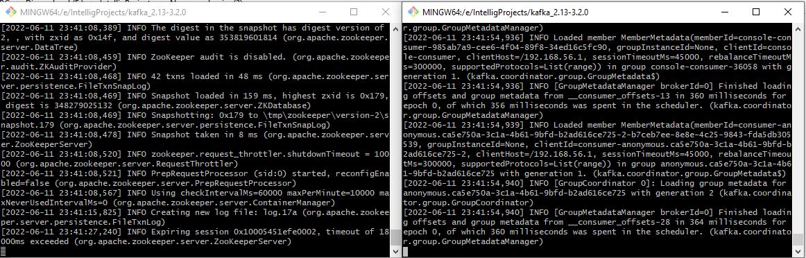 
<li>Consumer R1</li>
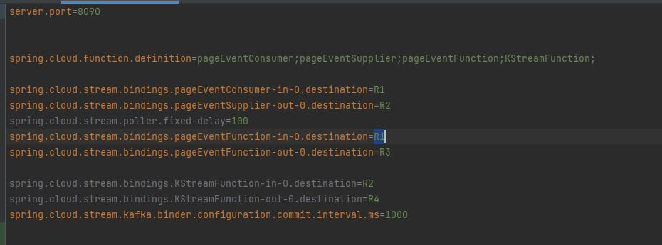 
<li><b>RestController</b></li>
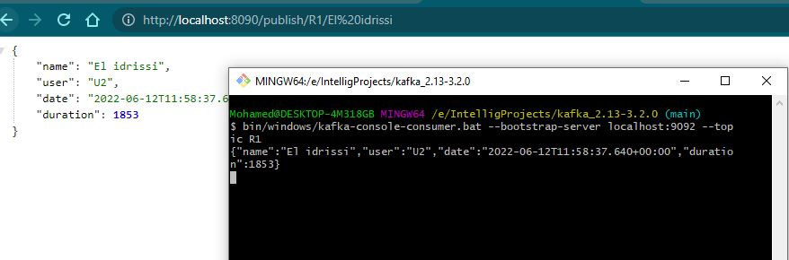
<h3>PageEventConsumer</h3>
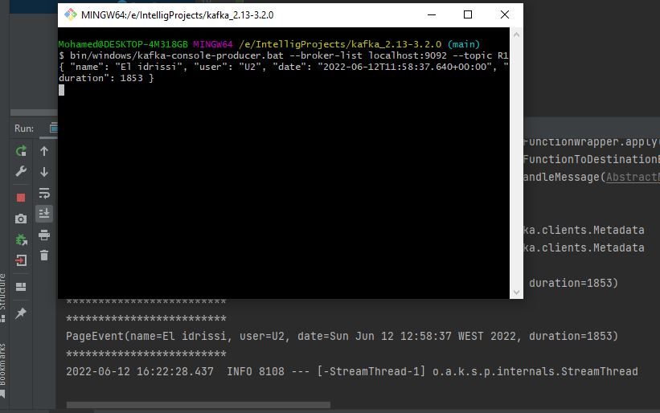 
<h3>PageEventSupplier</h3>
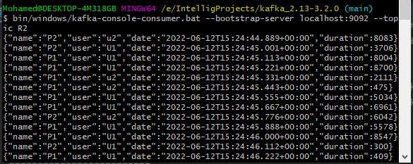 
<h3>pageEventFunction</h3>
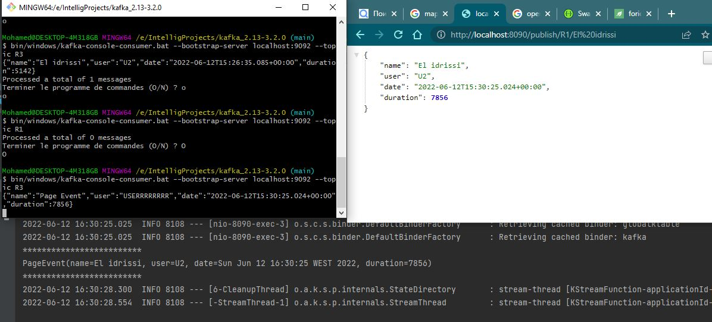 
<h3>KStreamFunction : Nombre de visites pour chaque page</h3>

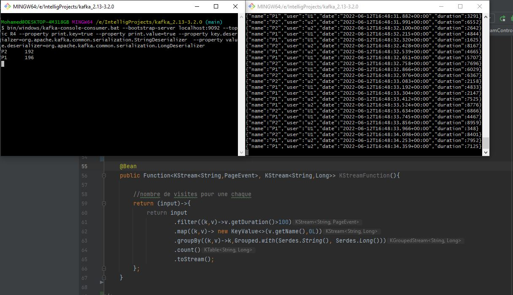
<h3>KStreamFunction : Nombre de visites pour chaque page 5 seconde avant</h3>

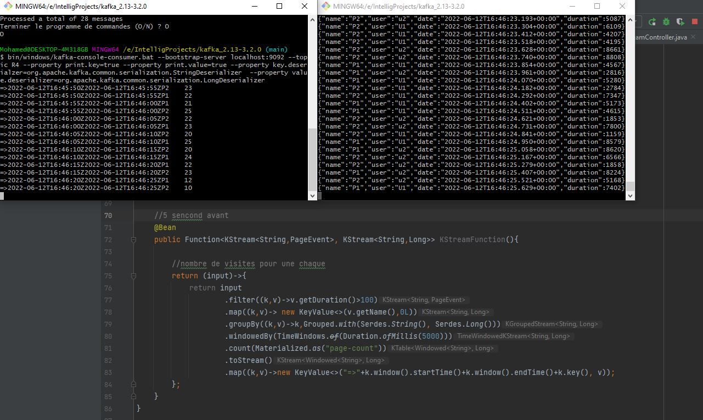
<h3>KStreamController</h3>
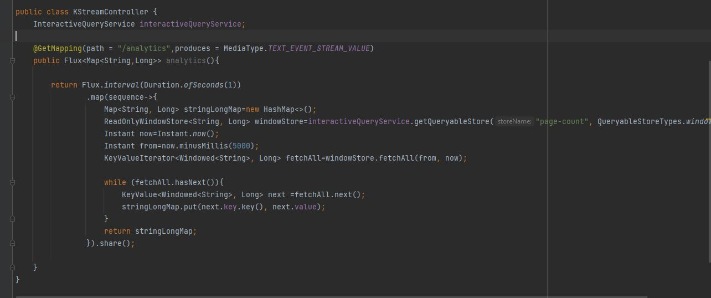
<h3>Result</h3>
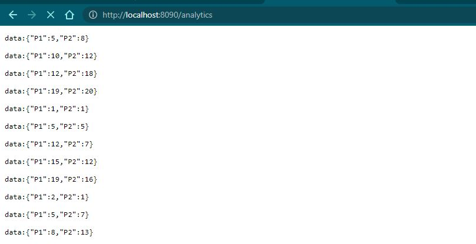
<h3>Index.html</h3>
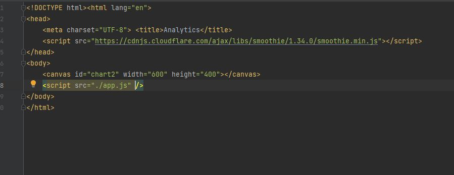
<h3>JavaScript</h3>
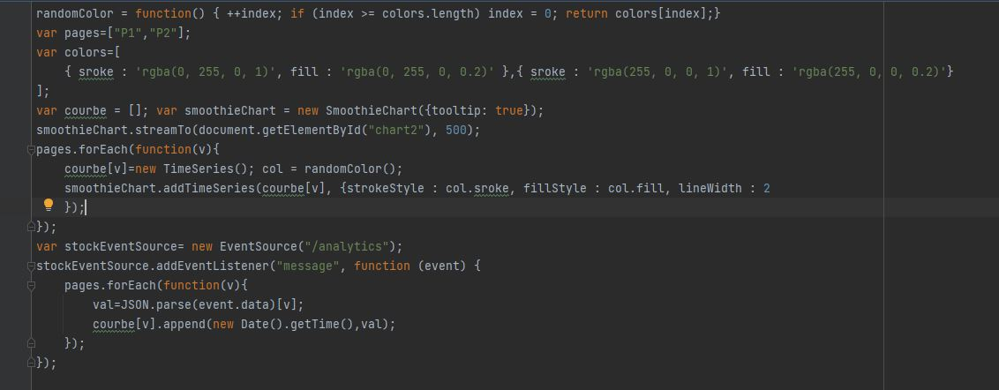
<h3>Graphe</h3>
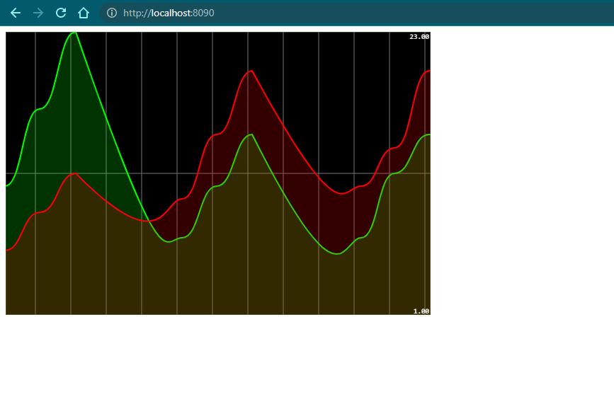

