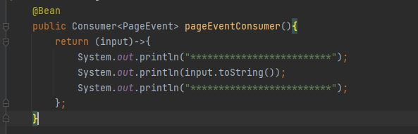

<h1>Kafka-Compte-Rendu</h1>

<h3>Dans ce TP on utilise spring cloud streams function</h3>
<li><b>Run Kafka broker et zookeeper</b></li>
 
<li><b>Run project</b></li>
 
<li>Run Consumer R1</li>
<li><b>application.properties</b></li>
 
<h3>Rest Controller</h3>
 
<li><b>Test</b></li>

<h3>PageEventConsumer</h3>
 
<li><b>Test</b></li>
 
<h3>PageEventSupplier</h3>
 
<li><b>Test</b></li>
 
<h3>pageEventFunction</h3>
 
<li><b>Test</b></li>
 
<h3>KStreamFunction : Nombre de visites pour chaque page</h3>

=> Ecoute sur le topic : R2

=> Poduire dans le topic : R4

 
<li><b>Test</b></li>

<h3>KStreamFunction : Nombre de visites pour chaque page 5 seconde avant</h3>

=> Ecoute sur le topic : R2

=> Poduire dans le topic : R4

 
<li><b>Test</b></li>

<h3>KStreamController</h3>

<h3>Result</h3>

<h3>Index.html</h3>

<h3>JavaScript</h3>

<h3>Graphe</h3>

